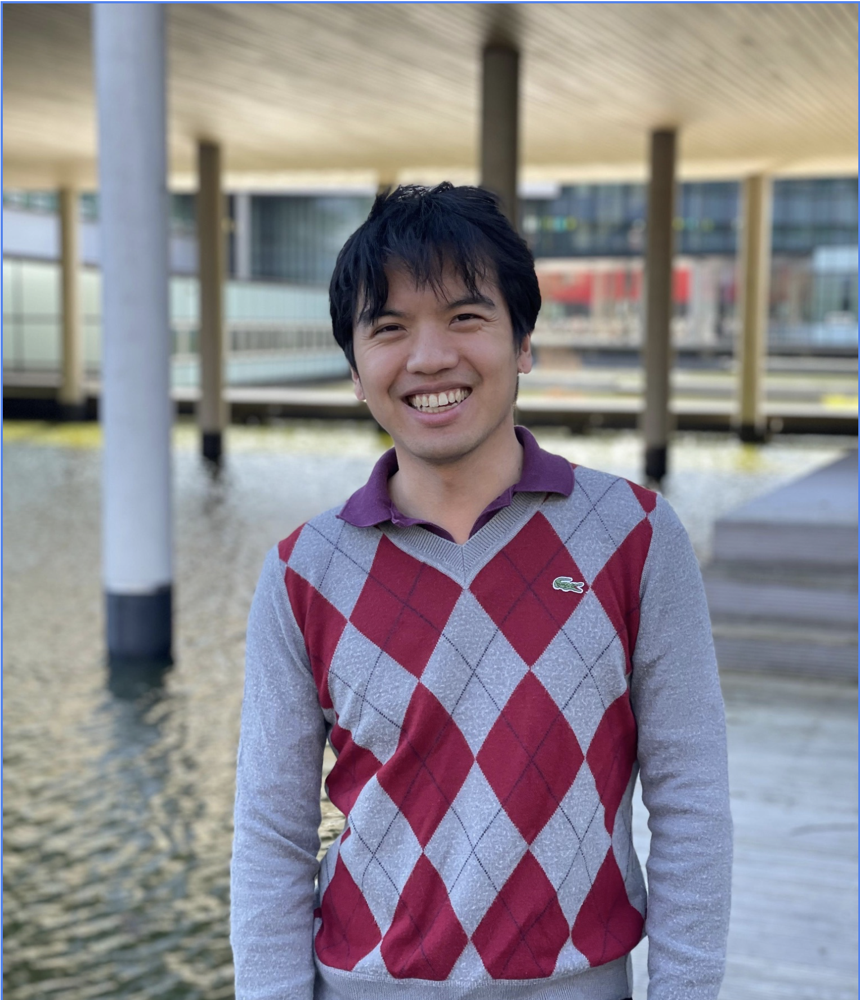

# Clément Lezane

**Postdoctoral Researcher in Optimization**  
📍 [ANITI Toulouse]  
📧 [clement.lezane@univ-toulouse.fr]

## About Me
I am a Postdoctoral Researcher at ANITI Toulouse, working in collaboration with Jérôme Bolte, Jean-Michel Loubes, and François Bachoc. My current research focuses on developing rigorous machine learning metrics to evaluate and benchmark the fairness of existing optimization algorithms.

Prior to joining ANITI, I earned my Ph.D. in Applied Mathematics from the University of Twente (Department of Stochastic Operations Research). My doctoral research, co-supervised by Sophie Langer, Wouter M. Koolen, Cristóbal Guzmán, and Alexandre d'Aspremont, culminated in my thesis, "First Order Methods with Non-Euclidean Geometry." During my doctoral studies, I collaborated closely with the SIERRA team at Inria Paris to develop accelerated optimization methods for machine learning applications.

### Research Interests
My research lies at the intersection of **optimization, machine learning, and statistics**, with a focus on designing optimal, accelerated algorithms for complex, large-scale problems. My specific areas of focus include:
* **Stochastic Convex Optimization**: Complementary composite minimization and randomized smoothing.
* **Accelerated First-Order Methods**: Mirror descent, non-Euclidean geometry, and star-convex functions.
* **Imbalanced Learning**: Algorithm design and analysis for datasets with highly skewed class distributions.
* **Minimax Problems**: Theoretical foundations and applications in algorithmic fairness and differential privacy.

### Contact & Profiles
[Google Scholar](#) | [ResearchGate](https://www.researchgate.net/profile/Clement-Lezane-2) | [GitHub](#) | [CV (PDF)](#)
